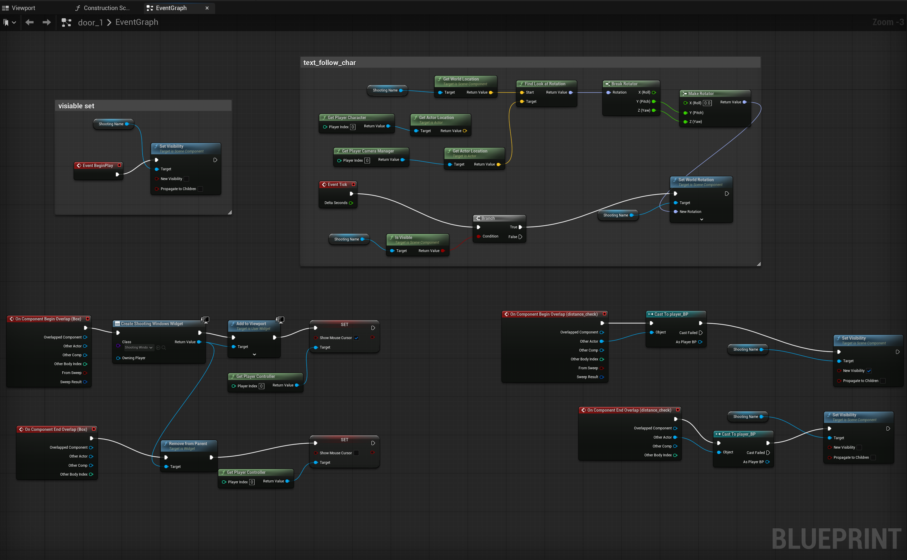
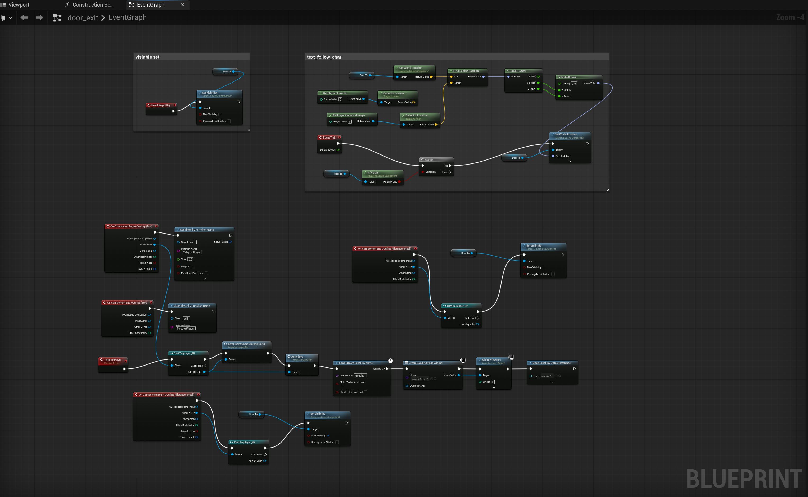
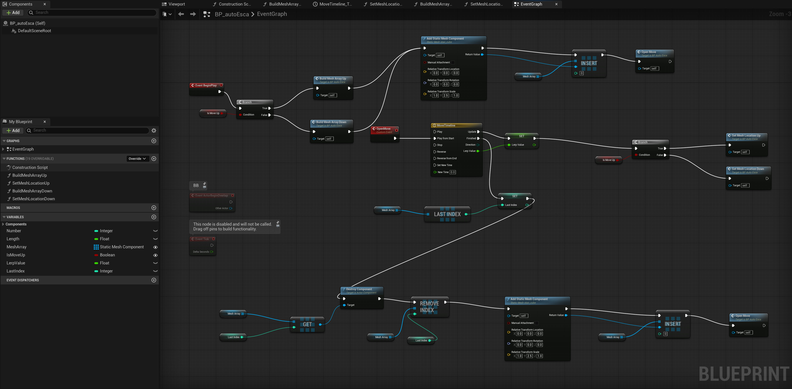
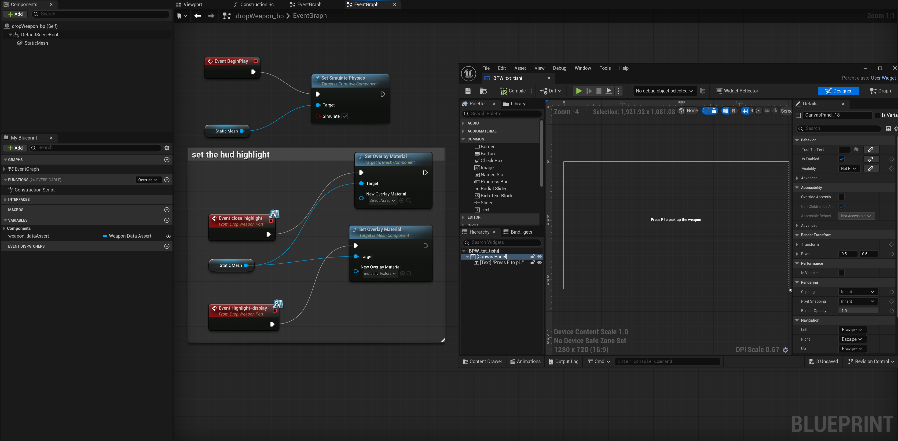

# UE5 Underground Multi-Floor Station Level  

This project is a complete **abandoned underground station level** built in **Unreal Engine 5.6.1**.  
It was designed, implemented, and polished end-to-end, including:

- Multi-floor environment construction  
- Blueprint systems for interaction, combat, and player guidance  
- Navigation flow from PlayerStart → final extraction point  
- Lighting, atmosphere, props, collision, and performance polish  
- A packaged Windows build for full playthrough
- A fully playable, polished Unreal Engine 5 environment featuring exploration, light combat, dynamic interactions, and blueprint-driven gameplay logic.

---

# Level Overview

The level is structured vertically, guiding the player through a sequence of interconnected spaces:

1. **Upper Waiting Hall**  
   - Initial spawn point  
   - Seating, signage, environmental storytelling  
   - Introductory lighting and mood
     
     
     
     
2. **Concourse Level**  
   - Benches, debris, broken boards, props  
   - HDRI outdoor walkway visible from this floor  
   - First set of optional weapons / items
     
     
     
     
     

3. **Outdoor Walkway (View Section)**  
   - HDRI skybox integration  
   - Provides spatial depth and realism
       
     
     

4. **Platform Level**  
   - Railings, barriers, trash bins  
   - Subtle lighting cues guiding the player  
   - Enemy encounter triggers
     
     
     

5. **Tunnel & Derailed Train Section**  
   - Tight corridors + darker atmosphere  
   - Derailed carriage set piece  
   - Final enemy spawn sequence  
   - Ends at extraction trigger
     
     
     
     

# Gameplay Features

### **Blueprint-Driven Interaction System**
- Text prompt widget appears when player approaches interactables  
- Blueprint Widgets used:  
  - `BP_txt_hudong`（Interactive prompts）  
  - `BPW_txt_tishi`（Screen prompt text）  

### **Automatic Escalator System**  
- Trigger → escalator starts moving  
- Uses `BP_autoEsca`  
- Smooth interpolation + player-safe movement  

### **Door & Path Progression System**  
- Player approaches → prompt appears  
- Press key → door opens  
- Correct sequencing ensures the level is “smoothly playable” end-to-end  

### **Enemy Spawn Triggers**  
- Enemies activate only when entering specific zones  
- Prevents pre-loading and avoids performance drops  

### **Weapon & Item Pickup System**  
- Optional pickups across different floors  
- Balanced to guide skill progression  

# Blueprints (Screenshots)

- Door interaction logic  
  
  
  

- Escalator movement system  
  

- Hint text UI blueprint  
  

# Full Playthrough (Video)
`[Insert your playthrough link here]`

This recording demonstrates:
- Full level flow  
- Blueprint interactions  
- Combat + pickups  
- Lighting & atmosphere  
- Final extraction sequence  

# Technical Highlights

### **Environment & Lighting**
- Modular meshes assembled for multi-floor layout  
- HDRI outdoor lighting integration  
- Volumetric fog + post-processing for mood  
- Polished props layout & collision fixes  

### **Blueprint Engineering**
- Modular interaction system  
- Trigger-driven spawn events  
- Automated movement (escalator)  
- UI/UX feedback (prompts / hint widgets)  
- Safe flow validation & player guidance  

### **Performance & Polish**
- Removed unused assets  
- Optimised collision on large meshes  
- Verified all trigger volumes  
- Cleaned environment clutter and alignment  
- Tested full run end-to-end on Windows build  

---

# Download (Project & Playable Build)

### **Packaged Game (Windows EXE)**  
**Download:**  
`[Your OneDrive ZIP link]`  

### **Full UE5 Project Source (.uproject + Content)**  
**Download:**  
`[Your OneDrive full project link]`  
Includes:

- All assets  
- Blueprints  
- Maps  
- Config  
- PlayerStart and triggers  
- Escalator BP  
- UI BP  

This repository does **not** contain the full UE5 project (too large).  
Instead, it contains all **documentation, screenshots, blueprints, and download links**.

Recommended structure:

