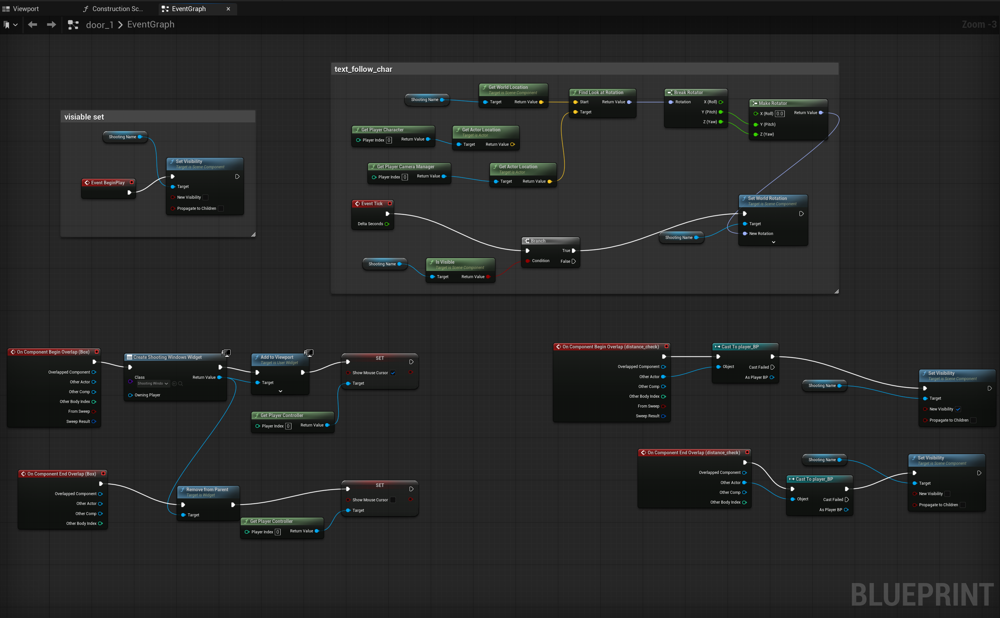
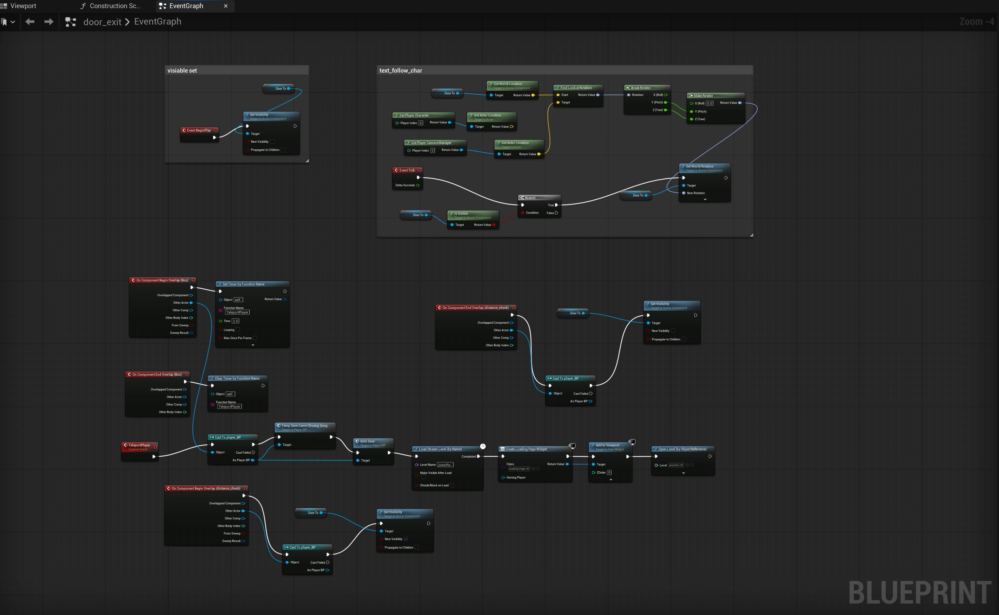
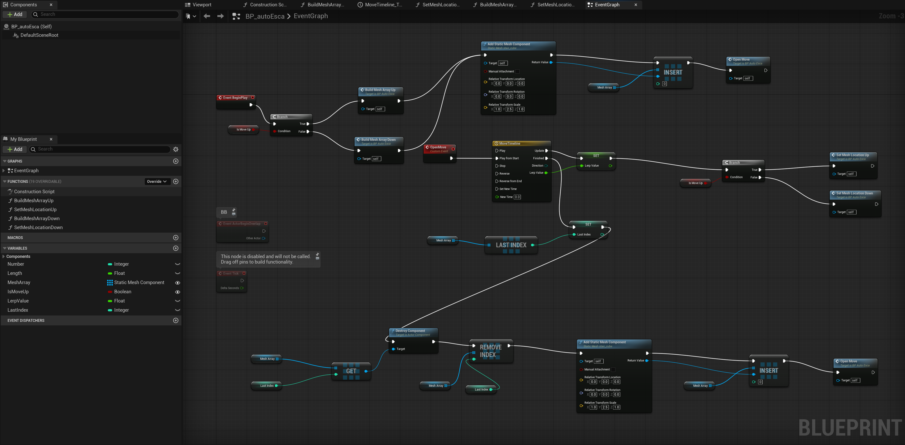
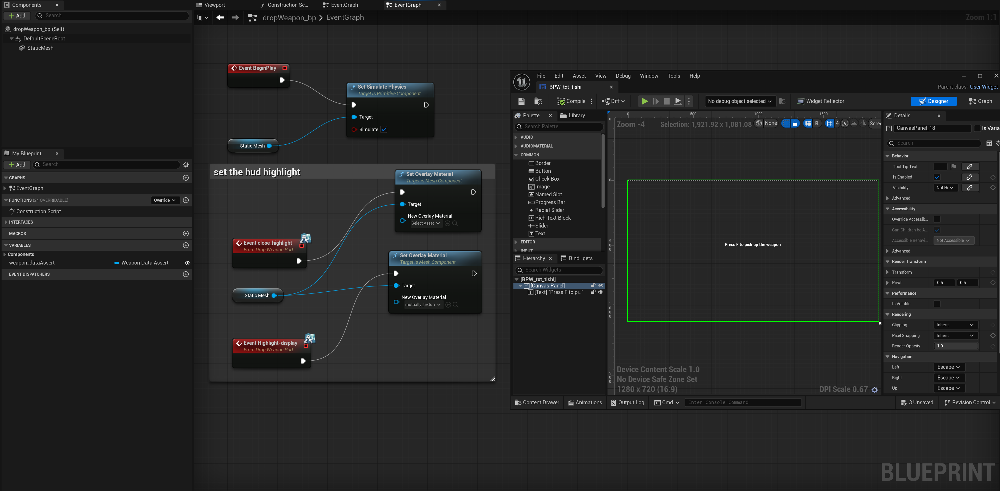

# UE5 Underground Multi-Floor Station Level

A **fully playable abandoned underground station level** built in **Unreal Engine 5.6.1**.  
This is an **end-to-end Unreal Engine project**, covering level design, Blueprint gameplay systems, lighting, and performance polish.

---

## Project Highlights

- Unreal Engine **5.6.1** vertical level design (multi-floor underground station)
- **Solo project**: design → implementation → polish
- Blueprint-driven **interaction, UI prompts, enemy triggers**
- Guided navigation from **PlayerStart → final extraction**
- Fully packaged **Windows build** (complete playthrough)
- Focus on **environment storytelling, player flow, and performance safety**

## Technical Highlights

### Environment & Lighting
- Modular meshes assembled into a multi-floor layout  
- HDRI outdoor lighting integration  
- Volumetric fog and post-processing for atmosphere  
- Polished prop placement and collision alignment  

### Blueprint Engineering
- Modular interaction system  
- Trigger-driven enemy spawns  
- Automated escalator movement  
- UI feedback via reusable widgets  
- Validated level flow from start to extraction  

### Performance & Polish
- Removed unused assets  
- Optimised collision on large meshes  
- Verified all trigger volumes  
- Cleaned environment clutter and alignment  
- Tested full playthrough on packaged Windows build

## Design Intent

This project was created to:

- Practice **vertical level navigation** in Unreal Engine  
- Guide players using **lighting, props, and spatial cues** rather than explicit UI arrows  
- Build **modular Blueprint systems** reusable across environments  
- Maintain stable performance while using dynamic interactions and AI triggers  

---

## Level Overview

The level is structured vertically, guiding the player through a sequence of interconnected spaces with clear visual cues and progressive gameplay beats.

### Upper Waiting Hall
Initial spawn area introducing mood, scale, and environmental storytelling.

---

### Concourse Level
Mid-level transition space with debris, props, and optional item pickups.

- Benches, broken boards, scattered debris  
- Outdoor HDRI walkway visible from this floor  
- First optional weapons / items

---

### Outdoor Walkway (View Section)
A visual break from enclosed spaces, adding spatial depth and realism.

- HDRI skybox integration  
- Environmental contrast before re-entering underground areas

---

### Platform Level
Combat-oriented space with subtle lighting and layout cues guiding player movement.

- Railings, barriers, platform props  
- Enemy encounter triggers  
- Navigation guided through lighting and structure

---

### Tunnel & Derailed Train Section
Final sequence with tighter spaces and darker atmosphere.

- Narrow corridors and reduced visibility  
- Derailed train set piece  
- Final enemy spawn sequence  
- Ends at extraction trigger

---

## Gameplay Features

### Blueprint-Driven Interaction System
- Context-based text prompts appear near interactable objects  
- Reusable UI widget system

**Blueprint Widgets:**
- `BP_txt_hudong` – Interaction prompts  
- `BPW_txt_tishi` – On-screen hint text  

---

### Automatic Escalator System
- Trigger-based activation when player approaches  
- Smooth, timeline-driven movement  
- Player-safe collision handling

**Blueprint:** `BP_autoEsca`

---

### Door & Path Progression System
- Interaction prompt appears when player approaches  
- Input-gated door opening  
- Ensures correct level progression and smooth flow

---

### Enemy Spawn Triggers
- Volume-based activation  
- Enemies remain dormant until player enters combat zones  
- Prevents unnecessary AI ticking and improves performance

---

### Weapon & Item Pickup System
- Optional pickups placed across multiple floors  
- Designed to support gradual skill and combat progression

---

## Blueprint Examples

### Door Interaction Logic
State-based door interaction with input validation and progression control.

---

### Escalator Movement System
Timeline-driven escalator movement with collision safety.

---

### Hint Text UI System
Reusable widget-based UI prompt system.

---

## Full Playthrough Video

A full recorded playthrough demonstrating:

- Complete level flow  
- Blueprint interactions  
- Combat and item pickups  
- Lighting and atmosphere  
- Final extraction sequence  

**Video:** `[Insert playthrough link here]`

## Download

### Packaged Game (Windows)
- Platform: Windows  
- Unreal Engine version: 5.6.1  

**Download:**  
`[[Windows build ZIP lin](https://drive.google.com/drive/folders/1NYgutUPhsYXTx3ksWA8IZWykiwtm7k73?usp=sharing)]`

### Full UE5 Project Source
Includes:
- Full Unreal Engine project  
- Maps, assets, Blueprints, UI systems  
- PlayerStart, triggers, escalator BP  

**Download:**  
`[[full project link](https://drive.google.com/drive/folders/1J7oBBeE6-gXomQ9xo9Kn_41dar-nEcRf?usp=drive_link)]`

> Note: Due to size limits, this GitHub repository contains **documentation, screenshots, and Blueprint examples only**.  
> The full UE5 project and packaged build are provided via external download links.

---

## License

This project is provided for **portfolio and educational purposes**.
